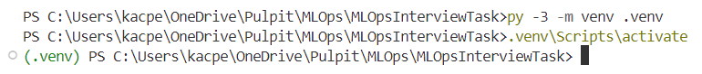
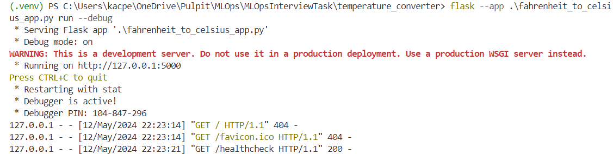
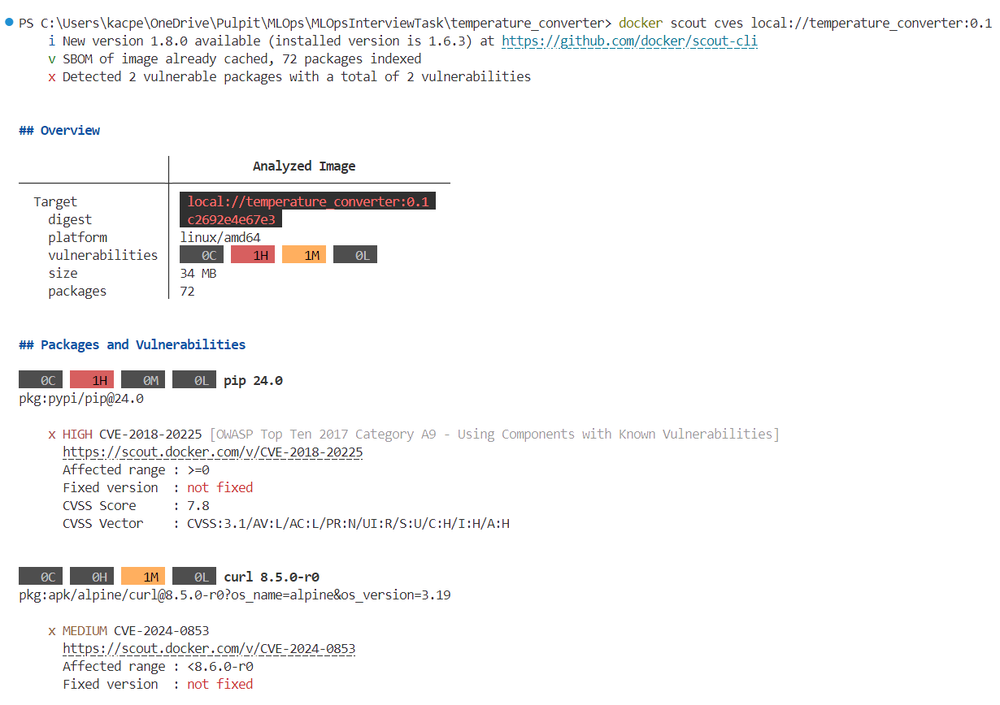
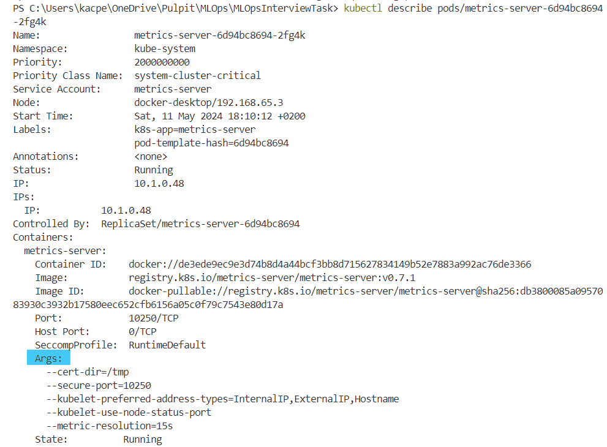
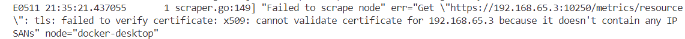
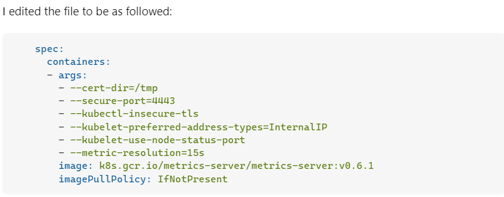
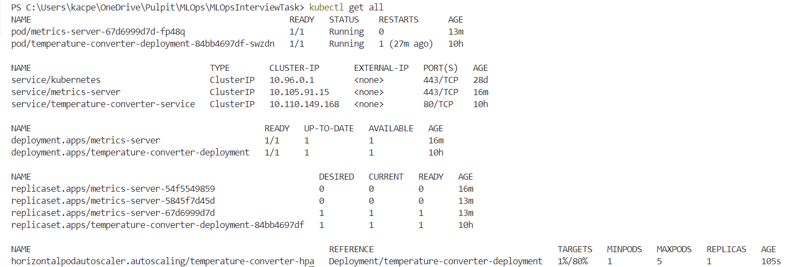

# MLOpsInterviewTask

# **1. fahrenheit_to_celsius_app backend in Flask**

- [x] Create a web app backend (without frontend) using Python or Golang. The API call
should calculate Celsius temperature based on Fahrenheit temperature. The app should
use HTTP protocol. As a response send Celsius temperature and app identifier randomly
generated inside the app during startup.

`Flask` is a micro-framework written in Python which enables creating web apps with minimum dependencies. As backend app needs only to calculate a temperature in celsius degrees based on fahrenheit temeperatue and create only several (for calculating, wrong api handling and healthcheck) endpoinds Flask is the best fit for that. 

- As to begin create virtual environment in Python:
    >The venv module supports creating lightweight “virtual environments”, each with their own independent set of Python packages installed in their site directories. A virtual environment is created on top of an existing Python installation, known as the virtual environment’s “base” Python, and may optionally be isolated from the packages in the base environment, so only those explicitly installed in the virtual environment are available.

  ***This step requires `Python 3.3^` being installed and environment variable for python set in the host system.***

  After setting your python environment run the following commands to create your virtual environment in `.venv` directory in current path and run activating scripts:
  ```bash
    py -3 -m venv .venv
    .venv\Scripts\activate
  ```
  The `venv` should be activated and look simiraly as on below screenshot:
  

- Install flask in your virtual environment:
  ```bash
  pip install Flask
  ```

- To create simple ask converting fahrenheit to celsius degrees, firstly use the Flask constructor to initialize flask app instance with passing `__name__` argument which informs Flask about currently used Python module:
   ```python
   app = Flask(__name__)
   ```
   Now we can start writing app.

- For generation of unique app identifier during each app startup we use `uuid4` module. To see more visit [https://www.uuidgenerator.net/version4](https://www.uuidgenerator.net/version4)

- Then create endpoints for converting temperature:
  ```python
    @app.route('/api/convert-fahrenheit-to-celsius', methods=['GET'])
    def convert_fahrenheit_to_celsius():
        fahrenheit_temp_str = request.args.get('fahrenheit')
        
        if fahrenheit_temp_str is None or fahrenheit_temp_str.strip() == '':
            return jsonify({'error': 'Please provide the Fahrenheit temperature as a query parameter.'}), 400
        
        try:
            fahrenheit_temp = float(fahrenheit_temp_str)
            
            celsius_temp = (fahrenheit_temp - 32) * 5/9

            return jsonify({'celsius': celsius_temp, 'app_identifier': app_identifier}), 200
        except ValueError:
            return jsonify({'error': 'Invalid input. Please provide a valid Fahrenheit temperature.', 'app_identifier': app_identifier}), 400
  ```

  Endpoint for wrong api handling:
  ```python
    @app.errorhandler(404)
    def page_not_found(e):
        return jsonify({'error': 'API not found.', 'app_identifier': app_identifier}), 404
  ```

  Finally create endpoint for healthcheck (it would be usefull to send liviness and readiness probes in kubernetes to check wheather the pod has started/is runnig correctly):
  ```python
    @app.route('/api/healthcheck', methods=['GET'])
    def healthcheck():
        return jsonify({'app_identifier': app_identifier}), 200
  ```
- Create the `__init.py__` file in your project directory to inform Python interpreter to treat the project as a module, for more see: [https://docs.python.org/3/reference/import.html#regular-packages](https://docs.python.org/3/reference/import.html#regular-packages)

- Define the starting listening point of your app:
  ```python
  if __name__ == '__main__':
    app.run(host='0.0.0.0', port=5000)
  ```
- Finally, run app by specifying the main file with the `app.run` command:
  ```bash
  flask --app .\.venv\fahrenheit_to_celsius_app.py run --debug
  ```
  After your server starts in debug mode check in browser if it is runnig as expected
  

Above main app file can be seen [here](./temperature_converter/fahrenheit_to_celsius_app.py)

# Docker images for fahrenheit_to_celsius_app

- [x] Create a docker image to run the application from step 1.

Simple flask docker images can be found directly in the source below:
[https://docs.docker.com/samples/flask/](https://docs.docker.com/samples/flask/)

To create basic `Dockerfile` use as a base image newest `python` image with limited dependecies as `alpine` image (to minimize the number of vulnerabilities and unwanted dependecies). Then upgrade pip, create the flask env to define location of main file, copy the project code, install requirements and run app. All these steps give [temperature_converter.development.Dockerfile](./temperature_converter/temperature_converter.development.Dockerfile):

(moreover to install all dependencies create the requirements.txt file in project structure and specify there `flask` dependency as in [requirements.txt](./temperature_converter/requirements.txt))

```dockerfile
# syntax=docker/dockerfile:1.4
FROM python:3.12-alpine

RUN pip install --upgrade pip

WORKDIR /home/fahrenheit_to_celsius_app

ENV FLASK_APP=fahrenheit_to_celsius_app.py

COPY . .

RUN pip install -r requirements.txt

EXPOSE 5000

CMD ["flask", "run", "--debug"]
```

For tightening security and running with production server as `unicorn` change above file to one shown below (or copy from [temperature_converter.production.Dockerfile](./temperature_converter/temperature_converter.production.Dockerfile)):
```Dockerfile
# syntax=docker/dockerfile:1.4
FROM python:3.12-alpine

WORKDIR /home/fahrenheit_to_celsius_app

COPY requirements.txt .

RUN pip install --upgrade pip && pip install --no-cache-dir -r requirements.txt && pip install gunicorn

COPY . .

RUN adduser -D nonroot && \
    chown -R nonroot:nonroot /home/fahrenheit_to_celsius_app && \
    mkdir -p /var/log/fahrenheit_to_celsius_app && touch /var/log/fahrenheit_to_celsius_app/fahrenheit_to_celsius_app.err.log && touch /var/log/fahrenheit_to_celsius_app/fahrenheit_to_celsius_app.out.log && \
    chown -R nonroot:nonroot /var/log/fahrenheit_to_celsius_app


ENV FLASK_APP=fahrenheit_to_celsius_app.py
ENV FLASK_RUN_HOST=0.0.0.0

USER nonroot

CMD ["gunicorn", "-w", "4", "-b", "0.0.0.0:5000", "fahrenheit_to_celsius_app:app"]
```

***Do not treat above as a final production image but only as a more suitable one in acheving production image***

Build the image using the command:
```bash
docker build -t temperature_converter:0.1.0 -f <path_to_dockerfile> .
```


After building image, view a summary of vulnerabilities and recommendations by running:
```bash
 docker scout cves local://temperature_converter:0.1.0
```


As shown below, created image has one high vulnerability in pip package which does not make it the best choice for the production image.


To make this image reachable from web we post it in `DockerHub` repository:
```bash
docker tag temperature_converter:0.1.0 kacperpap/temperature_converter:0.1.0
docker push kacperpap/temperature_converter:0.1.0
```

Now it can be simply accessed by running:
```bash
dokcer pull kacperpap/temperature_converter:0.1.0
```

# Create helm chart

- [x] Create a helm chart to deploy your app in the Kubernetes (k8s) environment. You can
use a locally hosted Minikube for that purpose. The app should scale automatically
based on the CPU usage metric between 1-5 replicas. The port exposed by the
kubernetes service should be configurable.

For below steps I use Kubernetes in Docker Desktop. See: [https://docs.docker.com/desktop/kubernetes/](https://docs.docker.com/desktop/kubernetes/)
>Docker Desktop includes a standalone Kubernetes server and client, as well as Docker CLI integration that runs on your machine. The Kubernetes server runs locally within your Docker instance, is not configurable, and is a single-node cluster. It runs within a Docker container on your local system, and is only for local testing.


**1. Build kubernetes yaml for service, deployment and hpc**

At first we create all the necessary kubernetes workloads. We need to define `deployment` which enables us to define the schema of deploying pods. 
>ReplicaSets are focused on maintaining a specified number of pod replicas for scalability and high availability, Deployments build on top of ReplicaSets to provide more advanced features for managing the lifecycle of applications, including rolling updates, rollbacks, and declarative management of application versions.

Deployment definition [temperature_converter.deployment.yaml](./temperature_converter.deployment.yaml)
```yaml
apiVersion: apps/v1
kind: Deployment
metadata:
  name: temperature-converter
spec:
  selector:
    matchLabels:
      app.temperature-converter/name: temperature-converter
      app.temperature-converter/instance: fahrenheit-to-celsius
      app.temperature-converter/component: backend
  template:
    metadata:
      labels:
        app.temperature-converter/name: temperature-converter
        app.temperature-converter/instance: fahrenheit-to-celsius
        app.temperature-converter/component: backend
    spec:
      containers:
        - name: temperature-converter
          image: kacperpap/temperature_converter:0.1.0
          ports:
            - containerPort: 5000
          resources:
            requests:
              cpu: 100m
            limits:
              cpu: 200m
```

The deployment defines which resources it selects based on `selector.matchLabels`. Then in `template` we define our pod, which runs single container with our app, and exposes the 5000 port as we defined in flask app. Then we define the requests and limits for CPU resources, as we want to scale our pods based on CPU usage. Note that there is not defined the replicaSet parameter, which is by default 1.

Next we create [temperature_converter.service.yaml](./temperature_converter.service.yaml) which takes care of discovery machanism of pods in deployment, which are ephemeral and change within time.
```yaml
apiVersion: v1
kind: Service
metadata:
  name: temperature-converter
  labels:
    app.temperature-converter/name: temperature-converter
    app.temperature-converter/instance: fahrenheit-to-celsius
    app.temperature-converter/component: backend
spec:
  selector:
    app.temperature-converter/name: temperature-converter
    app.temperature-converter/instance: fahrenheit-to-celsius
    app.temperature-converter/component: backend
  ports:
    - protocol: TCP
      port: 80
      targetPort: 5000
  type: ClusterIP

```
The service ip and port value specifies the endpoint for accesing a service, which directs the communications to the containers working in pods on port defined as targetPort.

Lastly we need to define the `HorizontalPodAutoscaler`:
>Horizontal scaling means that the response to increased load is to deploy more Pods. This is different from vertical scaling, which for Kubernetes would mean assigning more resources (for example: memory or CPU) to the Pods that are already running for the workload.

HPA is installed by default as a k8s module, but to use it we need to install `metrics-server` to monitor the basic metrics as CPU or memory usage. The installation process and requirements are described in `monitor-server` repository: [https://github.com/kubernetes-sigs/metrics-server#readme](https://github.com/kubernetes-sigs/metrics-server#readme).


***After installing metrics-server with default options there might appear an issue with security certificates passing to metrics-server. To not to verify the CA of serving certificates presented by kubelets it is possible to set `--kubelet-insecure-tls` argument in metrics-server. This is for testing purposes only.***

Default arguments:
```bash
kubectl describe pod/<pod-name>
```

***The metrics-server can be installed in different namespaces by different instalation approaches. Check where metric-server is installed on your host by:***
```bash
kubectl get pods --all-namespaces | grep metrics-server
```



Appearing error with CA passing:


To set `--kubelet-insecure-tls` argument in metrics-server follow these steps:
```bash
kubectl edit deployments/metrics-server
```
Add `--kubelet-insecure-tls` arg as shown below: 


Restart deployment of metrics server:
```bash
kubectl rollout restart deployment/metrics-server
```

Now we can create HPA by CLI
```
kubectl autoscale deployment temperature-converter-deployment --cpu-percent=50 --min=1 --max=5
```

Or define it as the yaml file (which will be needed to create helm chart): [temperature_converter.hpa.yaml](./temperature_converter.hpa.yaml):

```yaml
apiVersion: autoscaling/v2
kind: HorizontalPodAutoscaler
metadata:
  name: temperature-converter
  labels:
    app.temperature-converter/name: temperature-converter
    app.temperature-converter/instance: fahrenheit-to-celsius
    app.temperature-converter/component: backend
spec:
  scaleTargetRef:
    apiVersion: apps/v1
    kind: Deployment
    name: temperature-converter
  minReplicas: 1
  maxReplicas: 5
  metrics:
    - type: Resource
      resource:
        name: cpu
        target:
          type: Utilization
          averageUtilization: 80
```

The above definition scales horizontaly pods based on average utilization of CPU resources from 1 to 5 replicas. The utilization type of scaling means that decision about scaling will be made upon the average usage of CPU of all running pods as specified:
```
desiredReplicas = ceil[currentReplicas * ( currentMetricValue / desiredMetricValue )]
```

Now we can apply all parts and check wheather it works correctly:
```bash
kubectl apply -f .\temperature_converter.deployment.yaml 
kubectl apply -f .\temperature_converter.service.yaml  
kubectl apply -f .\temperature_converter.hpa.yaml  
```

After a few seconds we should see all above working with metric referenced to deployment.


To check from outside of the kubernetes cluster if the app is working we need to port forward connection to service:
```bash
kubectl port-forward service/temperature-converter-service 80:5000
```

**2. Creating helm chart**

Helm charts enables to automatically deploy complex kubernetes applications. To create one we can simply generate the helm directory components by CLI:

```bash 
mkdir <chart_name>
heml create <chart_name>
```

Then we need to change generated files in `/templates` to make them adecuate to ones shown above. As our app requires no chart dependencies we leave the `/charts` directory empty. After all changes our helm chart will have structure:
```
[temp_conv_charts/](./temp_conv_charts/)
    [charts/](./temp_conv_charts/charts/)
    [templates/](./temp_conv_charts/templates/)
        [tests/](./temp_conv_charts/templates/tests/)
            [test-connection.yaml](./temp_conv_charts/templates/tests/test-connection.yaml)
        [_helpers.tpl](./temp_conv_charts/templates/_helpers.tpl)
        [deployment.yaml](./temp_conv_charts/templates/deployment.yaml)
        [hpa.yaml](./temp_conv_charts/templates/hpa.yaml)
        [service.yaml](./temp_conv_charts/templates/service.yaml)
        [NOTES.txt](./temp_conv_charts/templates/NOTES.txt)
    [Chart.yaml](./temp_conv_charts/Chart.yaml)
    [values.yaml](./temp_conv_charts/values.yaml)
```


To install this helm chart run the command:
```bash
helm install <helm-chart-local-name> <helm-chart-location> 
```

We can set the service exposing port by changing the default value of `.service.port` defined in `values.yaml` by using `set` command:
```bash
helm install <helm-chart-local-name> <helm-chart-location> --set service.port=<port_number>
```

Test this as in :
[https://kubernetes.io/docs/tasks/run-application/horizontal-pod-autoscale-walkthrough/](https://kubernetes.io/docs/tasks/run-application/horizontal-pod-autoscale-walkthrough/)
